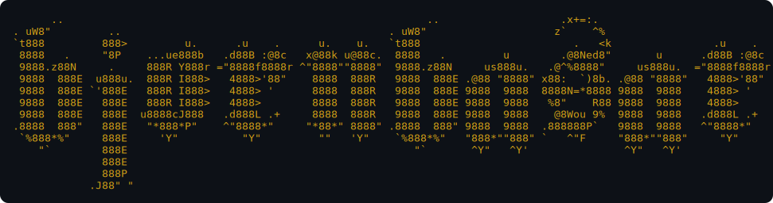

<div align="center">



### Bjorn Basar

*Full-stack developer with a homelab habit — small, dependency-light tools, run on my own iron.*

[](https://www.basar.co.nz)
[](https://www.minified.work)
[](https://linkedin.com/in/bjornbasar)


</div>

---

## `#[Get('/whoami')]`

```ts
const bjorn = {
  name:       "Bjorn Basar",
  location:   "New Zealand 🇳🇿",
  stacks:     ["PHP", "TypeScript", "Next.js", "Node.js"],
  philosophy: "Lightweight. Self-hosted. As few dependencies as I can get away with.",
  currently:  "Building karhu — a zero-dependency PHP microframework — and dogfooding apps on it",
  homelab:    "A small fleet of machines running Docker, Ansible, Prometheus/Grafana/Loki",
};
```

---

## `#[Get('/projects')]`

<details open>
<summary><b>🧩 The karhu ecosystem</b> — minimal, attribute-routed PHP 8.3+, zero runtime deps</summary>
<br>

| Repo | Description |
|------|-------------|
| [**karhu**](https://github.com/bjornbasar/karhu) | The core microframework |
| [**karhu-db**](https://github.com/bjornbasar/karhu-db) | Thin PDO wrapper + active-record base |
| [**karhu-view**](https://github.com/bjornbasar/karhu-view) | Template engine bridge (Twig/Plates) |
| [**karhu-queue**](https://github.com/bjornbasar/karhu-queue) | Minimal queue/worker abstraction |
| [**karhu-skeleton**](https://github.com/bjornbasar/karhu-skeleton) | Starter app |

</details>

<details>
<summary><b>🚀 Apps built on karhu</b></summary>
<br>

| Repo | Description |
|------|-------------|
| [**mishka**](https://github.com/bjornbasar/mishka) | Family hub web app (PostgreSQL, Twig) |
| [**istrbuddy**](https://github.com/bjornbasar/istrbuddy) | A karhu-powered issue tracker |

</details>

<details>
<summary><b>🔧 Other work</b> — mostly private repos</summary>
<br>

- **Web apps** — personal finance, recipe management, and TCG collection tools (Next.js + Prisma + PostgreSQL)
- **A Telegram / Slack / Messenger chatbot** and the odd HTML5 canvas game
- **Home lab & infra** — Docker, Ansible, CI/CD, and a Prometheus/Grafana/Loki monitoring stack across a self-hosted fleet

</details>

---

## `#[Get('/stack')]`

```json
{
  "languages":  ["PHP 8.3+", "TypeScript", "JavaScript", "Bash"],
  "frontend":   ["Next.js", "React", "Tailwind", "Twig"],
  "backend":    ["PHP", "Node.js", "Fastify", "PostgreSQL"],
  "devops":     ["Docker", "Ansible", "GitHub Actions", "Caddy / nginx"],
  "monitoring": ["Prometheus", "Grafana", "Loki", "Uptime Kuma"],
  "interests":  ["Self-hosting", "Lightweight infra", "Zero-dependency frameworks"]
}
```

---

## `#[Get('/stats')]`

<div align="center">

[](https://github.com/bjornbasar)
[](https://github.com/bjornbasar)


</div>

---

## `#[Get('/contact')]`

<div align="center">

[](https://www.basar.co.nz)
[](https://www.minified.work)

[](https://linkedin.com/in/bjornbasar)
[](https://facebook.com/bjornbasar)
[](https://instagram.com/bjornbasar)

📍 New Zealand · Building in the open where I can.

[](https://github.com/bjornbasar)

</div>
